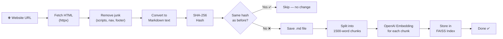
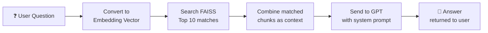
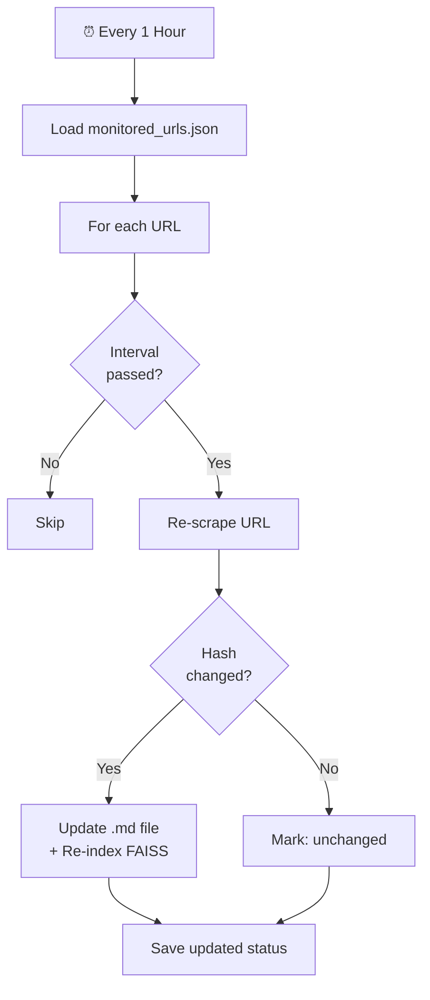
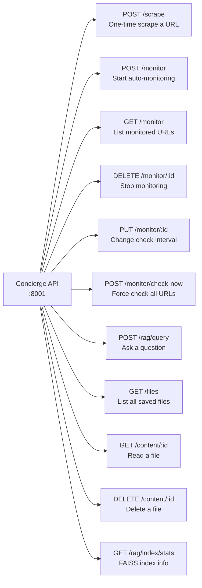

# Concierge API — Flowchart

Copy-paste any of these into https://mermaid.live to get a visual diagram.

---

## 1. MAIN FLOW — How the whole system works (Big Picture)

```mermaid
flowchart TB
    START([🚀 App Starts on Port 8001]) --> LOAD_FAISS[Load FAISS Vector Index from Disk]
    LOAD_FAISS --> START_SCHED[Start Scheduler - checks URLs every 1 hour]
    START_SCHED --> READY([✅ API Ready & Waiting for Requests])

    READY --> SCRAPE_REQ["/scrape" — One-time Scrape]
    READY --> MONITOR_REQ["/monitor" — Add URL to Auto-Monitor]
    READY --> RAG_REQ["/rag/query" — User Asks a Question]
    READY --> FILES_REQ["/files, /content, /delete" — Manage Files]
    READY --> SCHED_TICK["⏰ Scheduler Tick (every 1 hr)"]

    SCRAPE_REQ --> SCRAPE_FLOW
    MONITOR_REQ --> MONITOR_FLOW
    RAG_REQ --> RAG_FLOW
    SCHED_TICK --> AUTO_CHECK

    subgraph SCRAPE_FLOW ["SCRAPE FLOW"]
        S1[Fetch webpage HTML via httpx] --> S2[Convert HTML → Markdown]
        S2 --> S3[Compute SHA-256 Hash of content]
        S3 --> S4{Hash same as before?}
        S4 -- Yes --> S5[Return: unchanged]
        S4 -- No --> S6[Save .md file + .meta.json]
        S6 --> S7[Split text into chunks of ~1500 words]
        S7 --> S8[Get OpenAI embeddings for each chunk]
        S8 --> S9[Store vectors in FAISS index]
        S9 --> S10[Return: new/updated + content]
    end

    subgraph MONITOR_FLOW ["MONITOR FLOW"]
        M1[Check if URL already monitored] --> M2{Already exists?}
        M2 -- Yes --> M3[Return Error: 409 Conflict]
        M2 -- No --> M4[Scrape immediately - same as SCRAPE FLOW]
        M4 --> M5[Add URL to monitored_urls.json]
        M5 --> M6["Return: monitoring started ✅"]
    end

    subgraph AUTO_CHECK ["AUTO CHECK - Scheduler"]
        A1[Load all monitored URLs] --> A2[For each URL: has interval passed?]
        A2 -- Yes --> A3[Re-scrape and compare hash]
        A3 --> A4{Content changed?}
        A4 -- Yes --> A5[Update file + Re-index in FAISS]
        A4 -- No --> A6[Mark: unchanged]
        A2 -- No --> A7[Skip - not time yet]
    end

    subgraph RAG_FLOW ["RAG QUERY FLOW (User Asks Question)"]
        R1["User sends question: 'What about dining?'"] --> R2[Convert question → embedding vector]
        R2 --> R3[Search FAISS for top 10 similar chunks]
        R3 --> R4{Any chunks found?}
        R4 -- No --> R5[Return: No documents indexed yet]
        R4 -- Yes --> R6["Combine chunks into context text"]
        R6 --> R7["Send to GPT: system prompt + context + question"]
        R7 --> R8["GPT returns answer 💬"]
        R8 --> R9[Return answer + sources to user]
    end

    style START fill:#4CAF50,color:#fff
    style READY fill:#2196F3,color:#fff
    style S5 fill:#FF9800,color:#fff
    style S10 fill:#4CAF50,color:#fff
    style M3 fill:#f44336,color:#fff
    style M6 fill:#4CAF50,color:#fff
    style R5 fill:#FF9800,color:#fff
    style R9 fill:#4CAF50,color:#fff
```

---

## 2. SCRAPE FLOW — Step by step (Detailed)

---

## 3. RAG QUERY — How a user question gets answered

---

## 4. MONITORING — Auto-refresh cycle

---

## 5. ALL API ENDPOINTS — Quick Reference

---

## How to use these diagrams

1. Go to **https://mermaid.live**
2. Paste any code block above (just the part between the triple backticks)
3. It renders instantly as a visual flowchart
4. Click **Export** → PNG or SVG for your presentation slides
